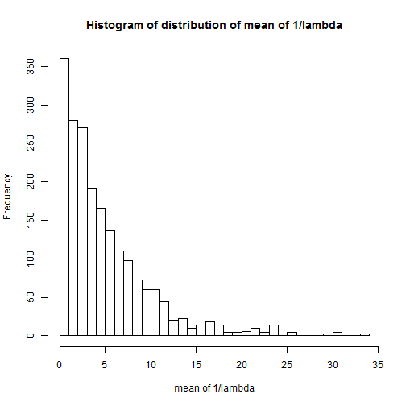
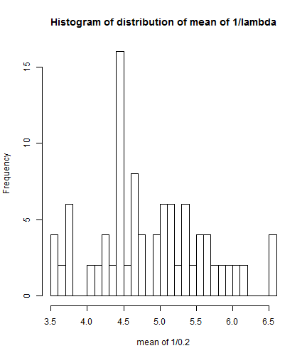
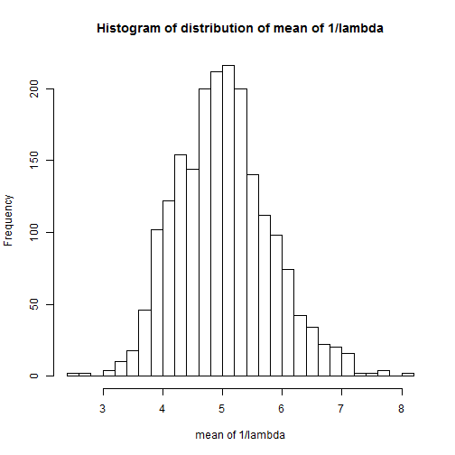

## Introduction

Why determine normality of mean of an exponential distribution

1. In several applications, data scientists collect data from real world.
2. This data need not be normally distributed.
3. Most applications involve computing means from some samples, to draw inferences about data.
4. *It is not clear how many samples are needed. This enables you to estimate number of samples required to compute mean so normality assumptions are valid.*

--- .class #id 

## Slide 2

## NVD3 Plot Inline

Below is histogram for exponential distribution. Notice that the distribution is not gaussian.

 

```
Error: attempt to apply non-function
```

--- .class #id 

## Sampling 100 means


1. 100 means estimated from 40 values
2. lambda = .2

 

```
Error: attempt to apply non-function
```

--- &radio
## Sampling more means

What will happen if we sampled 2000 means?

1. Means will follow exponential distribution
2. _Means will follow normal distribution_
3. Means will follow poisson distribution
4. Means will follow binomial distribution

*** .hint
Abnormal behavior becomes normal if repeated enough times

*** .explanation
Abnormal behavior becomes normal if repeated enough times

---

## Sampling 2000 means

1. 2000 means estimated from 40 values, lambda = .2
2. Mean eastimates follow normal distribution if enough observations are made.

 

```
Error: attempt to apply non-function
```


--- .class #id 

## Thank you 

Thanks for your time, and please visit the awesome shiny app at 
http://vyb5b.shinyapps.io/dataprod_PA/.

---
